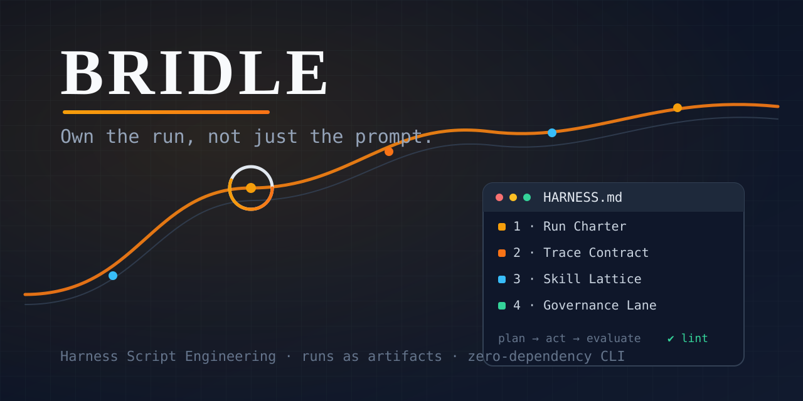

<p align="center">
  
</p>

<h1 align="center">Bridle</h1>

<p align="center"><strong>Harness Script Engineering for AI agents.<br/>Own the run, not just the prompt.</strong></p>

<p align="center">Created by <a href="https://www.linkedin.com/in/manpreet17/">Manpreet Singh</a> · Part of <a href="https://singhlabs.dev/bridle/">Singh Labs</a></p>

<p align="center">
  <a href="#quickstart">Quickstart</a> ·
  <a href="#the-four-pillars">Pillars</a> ·
  <a href="#the-cli">CLI</a> ·
  <a href="https://singhlabs.dev/bridle/">Product page</a>
</p>

<p align="center">
  
  =18" src="https://img.shields.io/badge/node-%E2%89%A518-blue">
  
</p>

---

## The one-liner

You already write `AGENTS.md` to tell agents **what your project is**.
**Bridle adds `HARNESS.md` to tell agents how their runs must behave** — the loop
they follow, what they must log, which skills they may touch in which phase, what
needs a PR, and how they recover after a crash. Then a tiny CLI lints the file and
stamps every run's trace with the exact harness version that governed it.

```
AGENTS.md    →  the OS for your project        (you probably have this)
HARNESS.md   →  the OS for every agent run     (this is Bridle)
```

Already have an `AGENTS.md` and no interest in a second file? Use just this:

```bash
npx github:manpreet171/bridle agents
```

It lints the file 60,000+ repos already commit — whether an agent can actually
act on it, and what it costs you in tokens on every single turn. Nothing else
lints it.

Prompts became artifacts. **Now runs become artifacts too.**

## Before / after

You set an agent loose on your backlog overnight. In the morning you ask what it
did. It edited eleven files, logged nothing, and merged something into `main` —
and the only record is a scrollback buffer that's already gone.

With Bridle:

```
GOOD  nightly-20260720T1015Z-a1b2c3
      harness v2.0.1 (9f3c01d2ab77) · 14 events · 0 escalations · 3 PRs, 0 direct pushes
```

More cases in [examples/](examples/).

## Why

"Vibe Engineering" fixed prompt chaos: short prompts, AI-written plans, human
approval. But run-level behavior — how agents act over hours or days, how they're
traced, evaluated, governed, recovered — still lives *inside your tools*, implicit
and invisible. When a long-running agent goes sideways at 3am, you can't debug a
policy that was never written down.

Bridle puts that policy in a file you commit.

## Quickstart

```bash
# in your project
npx github:manpreet171/bridle init
```

You get:

```
your-project/
├── AGENTS.md      # project OS (skipped if you already have one)
├── HARNESS.md     # ★ the Harness Script — fill in its 5 sections
├── prompts/       # AI-written implementation plans, human-approved
├── skills/        # tool know-how, tagged with cost/trust/role bands
└── logs/          # append-only run traces (JSON Lines)
```

Fill in `HARNESS.md`, then make it real:

```bash
npx github:manpreet171/bridle lint                      # refuses a harness missing any pillar
npx github:manpreet171/bridle run start scrape --agent claude-sonnet-5
npx github:manpreet171/bridle run log tool_call --detail '{"tool":"oxylabs","status":"ok"}'
npx github:manpreet171/bridle run log check_pass --phase evaluate
npx github:manpreet171/bridle run end good
npx github:manpreet171/bridle status
```

```
Recent runs:

  GOOD  scrape-20260720T1015Z-a1b2c3
        harness v1.2.0 (9f3c01d2ab77) · agent claude-sonnet-5 · 5 events · 0 escalation(s)
```

Every event carries the run ID, the agent, the harness **version** and a
**hash of the harness file** — so if someone edits the harness mid-run, the trace
shows it.

## The four pillars

Every `HARNESS.md` has four load-bearing sections. The linter enforces all of them,
because a run under an incomplete harness has undefined behavior.

| Pillar | Question it answers |
| ------ | ------------------- |
| **1 · Run Charter** | What does a *good run* observably look like? What loop (Plan → Act → Evaluate) does every step follow? What are the budgets, and which sub-agents may exist? |
| **2 · Trace Contract** | Which events — tool calls, code edits, DB writes, API hits — *must* be logged, where do they go, and how do they tie back to a `run_id` + harness version? |
| **3 · Skill Lattice** | Which skills (tagged cheap/frontier, safe/risky, read-only/write/destructive) may be used in which phase? Planning never writes. Evaluation uses different eyes. |
| **4 · Governance Lane** | Which changes auto-merge, which need a PR and a human, which surfaces are forbidden, and how does a run get rolled back? Your VCS is the control plane. |

Plus a fifth section, **Recovery & Escalation**: a per-run progress log, a resume
protocol so a restarted agent never redoes finished work, and explicit triggers
for stopping and calling a human.

## Written down, not locked down

Bridle is a document and a linter. It never sits between your agent and its work:
no server, no daemon, no API key, no runtime dependency, nothing phoning home, and
no added latency on your runs. If you delete the CLI tomorrow, your `HARNESS.md` is
still a useful document your agents read.

What it will never do is pretend it *enforced* something it only *recorded*. The
harness declares the policy; your trace proves what actually happened; branch
protection and CI are what physically stop a bad merge. Bridle makes the gap
between those three visible instead of imaginary.

## Start small: three tiers

You don't have to write all four pillars on day one. `--tier` lets the linter hold
you to as much as you've actually adopted, so CI stays green while you grow:

```bash
npx github:manpreet171/bridle lint --tier 1     # Run Charter only — what is a good run?
npx github:manpreet171/bridle lint --tier 2     # + Trace Contract — what must be logged?
npx github:manpreet171/bridle lint              # all four pillars + recovery (tier 3, the default)
```

One honest tier-1 harness beats four aspirational ones. Move up when the previous
tier stops being a lie.

## The CLI

One file, zero dependencies, Node 18+: [`bin/bridle.mjs`](bin/bridle.mjs).

| Command | What it does |
| ------- | ------------ |
| `bridle init` | Scaffold `HARNESS.md`, `AGENTS.md`, `prompts/`, `skills/`, `logs/` |
| `bridle lint [file] [--tier 1\|2\|3]` | Verify a harness honors the pillars for your tier + no unfilled placeholders. Exit 1 on failure — CI-friendly |
| `bridle agents [file]` | Lint `AGENTS.md`: runnable commands, the three things an agent asks first, unfilled placeholders, and what the file costs you per turn |
| `bridle run start <workflow>` | Mint a `run_id`, stamp harness version + SHA-256 hash |
| `bridle run log <event>` | Append a trace event (`tool_call`, `code_edit`, `db_write`, `api_hit`, `check_pass`, `check_fail`, `escalation`, `note`) |
| `bridle run end <good\|bad>` | Close the run with a Charter verdict |
| `bridle status` | Summarize recent runs: verdicts, harness versions, escalations |

Traces are plain JSON Lines validating against
[`schema/run-log.schema.json`](schema/run-log.schema.json) — pipe them anywhere
(LangSmith, PostHog, Supabase, `jq`). A ready-made GitHub Action lints every
harness on every PR: [`.github/workflows/harness-lint.yml`](.github/workflows/harness-lint.yml).

## What's in the box

```
bridle/
├── HARNESS.md                     # Bridle's own harness — we dogfood
├── templates/
│   ├── HARNESS.template.md        # ★ the Harness Script template
│   ├── AGENTS.template.md         # project-OS template
│   ├── SKILL.template.md          # skill + lattice bands
│   └── PROMPT.template.md         # AI-written plan, human-approved
├── examples/                      # real harnesses, all lint-clean at their tier
│   ├── minimal-tier1/             # ★ start here — a Charter and nothing else
│   ├── scraping-pipeline/         # 24h data pipeline, zero code edits
│   └── nightly-coding-agent/      # PR-only maintenance bot
├── schema/run-log.schema.json     # trace event schema (JSON Schema 2020-12)
├── bin/bridle.mjs                 # the whole CLI, ~300 lines, 0 deps
└── .github/workflows/harness-lint.yml
```

## Works with what you already use

Bridle is deliberately **not a framework**. Your orchestrator — Claude Code,
Copilot, LangGraph, DeepAgents, cron + scripts — stays the runtime. Bridle gives
it a script to follow:

- **Agent tools that load `AGENTS.md`** pick up the harness via one pointer line
  (already in the template).
- **Hooks/middleware** call `bridle run log` at the events your Trace Contract
  names; no hooks? The harness instructs the agent to call the CLI itself.
- **Your observability stack** ingests the JSONL; the schema is stable and tiny.
- **GitHub** enforces the Governance Lane with the included workflow + PR template.

Good neighbours, not competitors:

- [**ponytail**](https://github.com/DietrichGebert/ponytail) shrinks what your agent
  *builds*; Bridle governs how its *run behaves*. No overlap — ponytail never looks
  at your run policy, Bridle never opines on your code.
- **LangSmith / PostHog / Supabase** are trace *sinks*. Bridle's Trace Contract
  declares what must reach them; they store and visualize it.
- **`AGENTS.md`** is the project OS. Bridle is the run OS. Ship both.

## Uninstall

Nothing to uninstall, really — there's no global install. But to remove it cleanly:

```bash
rm HARNESS.md                    # or harness/*.HARNESS.md
rm -rf logs/                     # your run traces — read them before deleting
rm .github/workflows/harness-lint.yml
```

State Bridle writes outside those paths: **none.** The only file that isn't obvious
is `logs/.open-run.json`, which tracks the currently open run and is removed with
`logs/`. Your `AGENTS.md`, `prompts/`, and `skills/` are yours — `init` created them
but nothing in Bridle depends on them, so leave them.

## FAQ

**Is this a replacement for AGENTS.md / Vibe Engineering?**
No — it's the layer above it. Keep your `AGENTS.md`, skills, and AI-written
prompts. Vibe is how you stop fighting prompts on day 1; Harness Scripts are how
you stop fighting your agent architecture on day 30.

**Do agents actually follow a markdown policy?**
As well as they follow `AGENTS.md` — which is to say: well when it's loaded, and
verifiably when you check. That's why the Trace Contract exists: the trace is how
you *audit* compliance, not hope for it. Anything your orchestrator can enforce
mechanically (hooks, branch protection, CI lint), move from hope to enforcement.

**Does it need a config file?**
No. No config, no env vars, no API key, no account. `HARNESS.md` and the CLI are the
whole product.

**Do you have benchmark numbers?**
No — and I'm not going to invent any. Bridle is a documentation-and-audit discipline,
not a model intervention; there's no honest way to A/B "runs you could explain
afterwards" as a percentage. What I can show you is the mechanism: a trace stamped
with the harness version and hash, and a linter that exits 1. Judge it on that. If
you run a real comparison, open an issue — I'll link it here, including if it's
unflattering.

**One HARNESS.md or many?**
One per long-running workflow. Root `HARNESS.md` for your main one; extras in
`harness/<name>.HARNESS.md` — the linter finds both.

**Why "Bridle"?**
A bridle is the part of a harness that gives you steering. Same relationship: the
model provides the horsepower; the Harness Script decides where it's allowed to go.

## Further reading

The ideas here synthesize public work on agent harnesses: LangChain's harness
anatomy write-ups, Anthropic's engineering guidance on effective harnesses for
long-running agents, research on natural-language agent harnesses executed by
intelligent runtimes, and GitHub's & Microsoft's agentic-SDLC training. Bridle's
contribution is the packaging: one template, one schema, one linter, one habit.

## Contributing

PRs welcome — and yes, they run under [`HARNESS.md`](HARNESS.md). Bump the harness
version when you touch it, link your `run_id` in the PR template, and make sure
`bridle lint` is green.

## Author

**Manpreet Singh**

- LinkedIn: [linkedin.com/in/manpreet17](https://www.linkedin.com/in/manpreet17/)
- Medium: [medium.com/@singh.manpreet171900](https://medium.com/@singh.manpreet171900)
- Email: [info@singhlabs.dev](mailto:info@singhlabs.dev)

If you write about Harness Script Engineering or ship a `HARNESS.md` because of
this repo, I'd genuinely like to hear about it.

## License

[MIT](LICENSE) © Manpreet Singh
